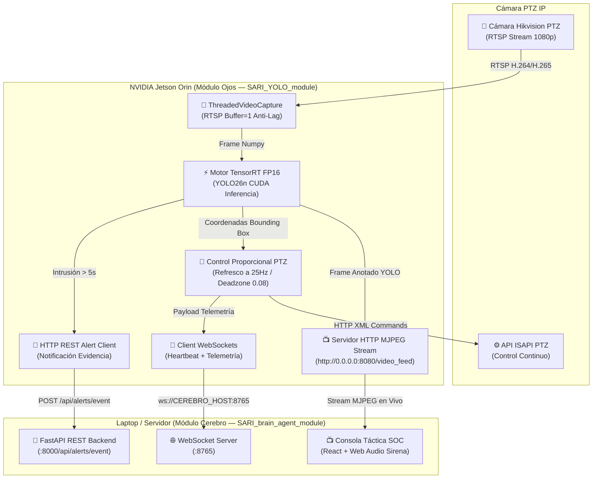

# 👁️ SARI YOLO Module — Módulo Ojos

**Módulo Ojos** es el nodo autónomo de visión por computadora y control PTZ del ecosistema **SARI (Sistema Autónomo de Respuesta a Intrusiones)**. Ejecutándose en dispositivos edge **NVIDIA Jetson Orin**, realiza captura de video RTSP multihilo de ultra-baja latencia, inferencia de objetos acelerada por GPU (**YOLO26n en TensorRT FP16**), seguimiento de precisión Hikvision PTZ a 25Hz y **servidor de video web en vivo MJPEG (Puerto 8080)**.

---

## 🏗️ Arquitectura del Sistema

El Módulo Ojos opera de forma independiente y en tiempo real en la Jetson, sirviendo la transmisión de video adaptada para navegadores web y enviando eventos de evidencia al **[SARI Brain Agent](https://github.com/suriel01/SARI_brain_agent_module.git)** (Módulo Cerebro).



---

## ⚡ Características Principales

1. **Transmisión de Video en Vivo Compatible con Navegadores (MJPEG HTTP)**:
   - **URL Stream MJPEG**: `http://<IP_JETSON>:8080/video_feed`
   - Superposición en tiempo real de cuadros delimitadores YOLO26n (verde normal, rojo en intrusión) y retícula central de seguimiento PTZ.
   - Compatible con cualquier navegador web (Chrome, Safari, Firefox), aplicaciones móviles y la consola táctica de **SARI Brain Agent**.

2. **Aceleración TensorRT FP16 en GPU NVIDIA**:
   - Compilación automática del modelo `yolo26n.pt` a `yolo26n.engine` optimizado para los núcleos CUDA de Jetson Orin.
   - Métricas de rendimiento impresas en consola cada 5 segundos (ej. `35.4 FPS | Latencia Inferencia: 14.2ms`).

3. **Seguimiento PTZ Ultra-Fluido (25Hz)**:
   - Cooldown de comandos de `0.04s` (25Hz) para seguimiento continuo sin congelamientos.
   - Algoritmo de velocidad proporcional suave con aceleración exponencial.
   - Zona muerta (*Deadzone*) de `0.08`.

4. **Detección de Alta Confianza (≥ 70%)**:
   - Filtrado estricto de personas (`CONFIDENCE_THRESHOLD=0.70`).

5. **Notificación Dual al Módulo Cerebro**:
   - **WebSockets (`ws://CEREBRO_HOST:8765`)**: Telemetría y estado PTZ continuo.
   - **REST API (`POST http://CEREBRO_HOST:8000/api/alerts/event`)**: Notificación automática al detectar intrusiones continuas de ≥ 5 segundos.

---

## 📁 Estructura del Repositorio

```text
SARI_YOLO_module/
├── camara_ptz.py         # Inferencia YOLO TensorRT, seguimiento PTZ y Servidor MJPEG (8080)
├── telegram_alert.py     # Canal directo de respaldo para alertas por Telegram
├── docker-compose.yml    # Despliegue Docker con soporte GPU NVIDIA y mapeo de puerto 8080
├── Dockerfile            # Construcción de la imagen Docker con OpenCV, PyTorch, CUDA y Flask
├── model_cache/          # Persistencia del motor compilado yolo26n.engine
├── docs/                 # Documentación y guías de integración
├── spec/                 # Especificaciones del módulo (SDD)
├── AGENTS.md             # Convenciones y estándares del Módulo Ojos
└── README.md             # Documentación principal
```

---

## 🛠️ Variables de Entorno

| Variable | Valor por Defecto | Descripción |
|---|---|---|
| `STREAM_PORT` | `8080` | Puerto HTTP donde se sirve la transmisión de video MJPEG |
| `CAMERA_IP` | `192.168.1.200` | Dirección IP de la cámara Hikvision PTZ |
| `CAMERA_USER` | `admin` | Usuario Digest de la cámara |
| `CAMERA_PASS` | `Asenso117925` | Contraseña de la cámara |
| `CEREBRO_HOST` | `192.168.1.79` | IP del servidor donde ejecuta `SARI_brain_agent_module` |
| `CEREBRO_PORT_WS` | `8765` | Puerto WebSocket del Módulo Cerebro |
| `CEREBRO_PORT_HTTP` | `8000` | Puerto HTTP REST del Módulo Cerebro |
| `CONFIDENCE_THRESHOLD` | `0.70` | Umbral de confianza mínimo de detección (70%) |

---

## 🚀 Inicio Rápido

### 1. Iniciar el Microservicio en Jetson
```bash
docker compose up --build -d
```

### 2. Probar la Transmisión de Video en Vivo
Abre tu navegador e ingresa a:
- **Vista Web Interactiva**: `http://<IP_JETSON>:8080/`
- **Flujo de Video Directo**: `http://<IP_JETSON>:8080/video_feed`
- **Captura Instantánea**: `http://<IP_JETSON>:8080/snapshot`

### 3. Monitorear Logs y FPS
```bash
docker compose logs -f
```

---

## 🔗 Repositorios Relacionados

- **[SARI Brain Agent Module](https://github.com/suriel01/SARI_brain_agent_module.git)**: Módulo Cerebro (Backend FastAPI, PostgreSQL, Consola SOC Táctica React y Agente Autónomo).
