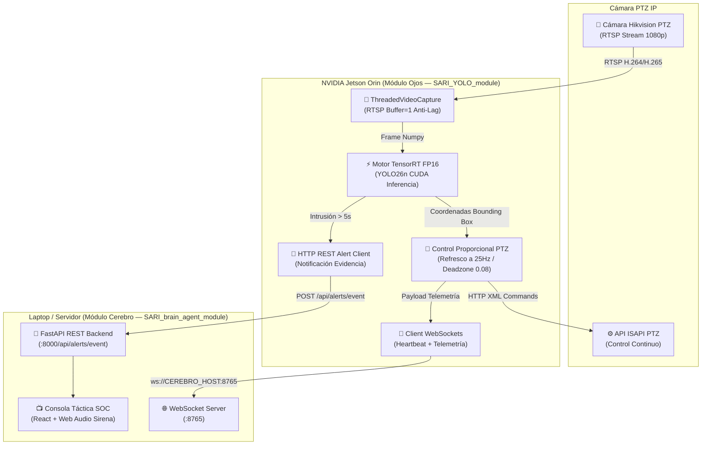

# 👁️ SARI YOLO Module — Módulo Ojos

**Módulo Ojos** es el nodo autónomo de visión por computadora y control PTZ del ecosistema **SARI (Sistema Autónomo de Respuesta a Intrusiones)**. Ejecutándose en dispositivos edge **NVIDIA Jetson Orin**, realiza captura de video RTSP multihilo de ultra-baja latencia, inferencia de objetos acelerada por GPU (**YOLO26n en TensorRT FP16**) y seguimiento de precisión Hikvision PTZ a 25Hz.

---

## 🏗️ Arquitectura del Sistema

El Módulo Ojos opera de forma independiente y headless en el hardware periférico de la cámara, enviando eventos de evidencia y telemetría continua al **[SARI Brain Agent](https://github.com/suriel01/SARI_brain_agent_module.git)** (Módulo Cerebro).



---

## ⚡ Características Principales

1. **Aceleración TensorRT FP16 en GPU NVIDIA**:
   - Compilación automática del modelo `yolo26n.pt` a `yolo26n.engine` optimizado para los núcleos CUDA de Jetson Orin.
   - Métricas de rendimiento y latencia en consola impresas cada 5 segundos (ej. `35 FPS | Latencia Inferencia: 14.2ms`).

2. **Seguimiento PTZ Ultra-Fluido (25Hz)**:
   - Frecuencia de comandos reducida a `0.04s` (25Hz) para eliminar congelamientos y tirones durante el seguimiento a alta velocidad.
   - Algoritmo de velocidad proporcional suave con aceleración exponencial según la distancia del objetivo al centro.
   - Zona muerta (*Deadzone*) reducida a `0.08` para reaccionar de forma inmediata a movimientos sutiles.

3. **Detección de Alta Confianza (≥ 70%)**:
   - Filtrado estricto de detecciones de personas (`CONFIDENCE_THRESHOLD=0.70`).

4. **Notificación Dual al Módulo Cerebro**:
   - **Telemetría continua (WebSockets)**: Emisión constante del conteo de personas y posición PTZ actual.
   - **Alertas de Evidencia (REST API)**: Notificación automática `POST /api/alerts/event` al detectar una persona durante más de 5 segundos continuos.

---

## 📁 Estructura del Repositorio

```text
SARI_YOLO_module/
├── camara_ptz.py         # Microservicio principal de visión, YOLO TensorRT y control PTZ
├── telegram_alert.py     # Canal directo de respaldo para alertas por Telegram
├── docker-compose.yml    # Configuración de despliegue Docker con runtime NVIDIA GPU
├── Dockerfile            # Construcción del contenedor con OpenCV, PyTorch y CUDA
├── model_cache/          # Persistencia del motor compilado yolo26n.engine
├── docs/                 # Documentación y guías de integración
├── spec/                 # Especificaciones del módulo (SDD)
├── AGENTS.md             # Convenciones y estándares de arquitectura del Módulo Ojos
└── README.md             # Documentación del proyecto
```

---

## 🛠️ Variables de Entorno

| Variable | Valor por Defecto | Descripción |
|---|---|---|
| `CAMERA_IP` | `192.168.1.200` | Dirección IP de la cámara IP Hikvision PTZ |
| `CAMERA_USER` | `admin` | Usuario de autenticación Digest de la cámara |
| `CAMERA_PASS` | `Asenso117925` | Contraseña de autenticación de la cámara |
| `CEREBRO_HOST` | `192.168.1.79` | IP del servidor donde ejecuta `SARI_brain_agent_module` |
| `CEREBRO_PORT_WS` | `8765` | Puerto WebSocket del Módulo Cerebro |
| `CEREBRO_PORT_HTTP` | `8000` | Puerto HTTP REST del Módulo Cerebro |
| `CONFIDENCE_THRESHOLD` | `0.70` | Umbral de confianza mínimo de detección (70%) |

---

## 🚀 Inicio Rápido (Despliegue en Jetson)

### 1. Iniciar el Microservicio
```bash
docker compose up --build -d
```

### 2. Monitorear Rendimiento y FPS
```bash
docker compose logs -f
```

### 3. Detener el Servicio
```bash
docker compose down
```

---

## 🔗 Repositorios Relacionados

- **[SARI Brain Agent Module](https://github.com/suriel01/SARI_brain_agent_module.git)**: Módulo Cerebro (Backend FastAPI, PostgreSQL, Consola SOC Táctica React y Agente Autónomo).
