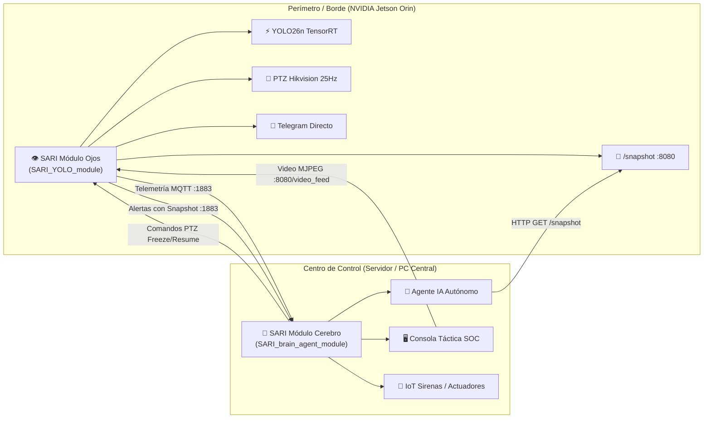

# 🛡️ Ecosistema SARI (Sistema Autónomo de Respuesta a Intrusiones)

## 1. Visión General del Ecosistema

**SARI** es una plataforma distribuida de seguridad perimetral inteligente basada en edge AI y agentes de toma de decisiones. El sistema está dividido en dos módulos desacoplados y altamente especializados:

---

## 2. Responsabilidades por Módulo

### 👁️ Módulo Ojos (NVIDIA Jetson Orin Nano)
- **Captura Multihilo**: Ingesta continua RTSP desde la cámara Hikvision con buffer mínimo (`buffer_size=1`) para latencia nula.
- **Inferencia Perimetral**: YOLO26n compilado a motor TensorRT FP16 (`yolo26n.engine`), detectando personas a ~30 FPS con filtros de persistencia.
- **Control Activo PTZ**: Seguimiento proporcional continuo a 25Hz (`cooldown=0.04s`, `deadzone=0.08`) para mantener el objetivo centrado.
- **Servidor HTTP Snapshot y MJPEG**:
  - `GET /snapshot`: Retorna fotograma actual JPEG bajo demanda para el Módulo Cerebro o Bots.
  - `GET /video_feed`: Stream de video anotado en vivo para la consola de monitoreo.
- **Telemetría y Estado de Nodo**:
  - Tópico `sari/nodes/{node_id}/status`: Last Will and Testament (LWT) retenido y mensaje de nacimiento (`online`).
  - Tópico `sari/nodes/{node_id}/telemetry`: Publicación periódica (cada 3s) de RAM, CPU, GPU Tegra, Temperatura y FPS.
- **Canal de Emergencia Directo**: Envío inmediato a Telegram (`telegram_alert.py`) ante caídas de enlace o intrusiones de alta severidad.

### 🧠 Módulo Cerebro (Servidor Central SARI Brain Agent)
- **Agente Autónomo de Decisión**:
  - Evalúa la severidad de la alerta en tiempo real con contexto histórico y perimetral.
  - Genera resúmenes ejecutivos del incidente y los documenta en la base de conocimientos.
- **Orquestación de Actuadores**:
  - Activa sirenas perimetrales, luces estroboscópicas o disuasión sonora a través de dispositivos IoT.
- **Control Táctico de Cámara**:
  - Publica comandos en `sari/nodes/{node_id}/config` para congelar seguimiento (`ptz_tracking: false`), reajustar presets o cambiar umbrales de sensibilidad.
- **Consola Táctica (SOC)**:
  - Visualización del stream de video en vivo de las cámaras perimetrales, gráficos de telemetría de nodos y registro cronológico de intrusiones.

---

## 3. Protocolos de Comunicación

| Canal | Protocolo | Endpoint / Tópico | Dirección | Descripción |
| :--- | :--- | :--- | :--- | :--- |
| **Telemetría** | MQTT (QoS 0) | `sari/nodes/{NODE_ID}/telemetry` | Ojos ➔ Cerebro | Métricas de CPU, GPU, RAM, Temp cada 3s |
| **Estado LWT** | MQTT (QoS 1, Retain) | `sari/nodes/{NODE_ID}/status` | Ojos ➔ Cerebro | Mensajes de conexión (`online`) y desconexión (`offline`) |
| **Alertas** | MQTT (QoS 1) | `sari/alerts` | Ojos ➔ Cerebro | Notificación de intrusión con snapshot Base64 |
| **Config / Control**| MQTT (QoS 1) | `sari/nodes/{NODE_ID}/config` | Cerebro ➔ Ojos | Comandos de control (PTZ lock, sensibilidad) |
| **Snapshots** | HTTP REST | `GET http://<JETSON_IP>:8080/snapshot` | Cerebro ➔ Ojos | Captura fotográfica instantánea en JPEG |
| **Video Feed** | HTTP MJPEG | `GET http://<JETSON_IP>:8080/video_feed` | Cerebro/SOC ➔ Ojos | Streaming de video con bounding boxes |
| **Emergencias** | HTTPS REST | `api.telegram.org/bot<TOKEN>/...` | Ojos ➔ Telegram | Canal de respaldo directo ante intrusión crítica |
