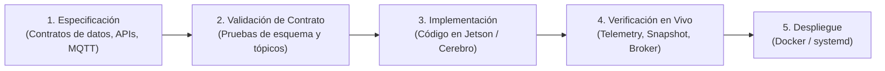

# 📋 Sistema de Spec-Driven Development (SDD) — SARI

Este directorio contiene las **especificaciones formales de arquitectura, protocolos de datos y contratos de integración** del ecosistema **SARI (Sistema Autónomo de Respuesta a Intrusiones)**, enfocado en el **Módulo Ojos (NVIDIA Jetson Orin)** y su interacción con el **Módulo Cerebro (Servidor Central)**.

---

## 🎯 ¿Qué es Spec-Driven Development en SARI?

En sistemas ciberfísicos e IoT críticos que combinan visión por computadora en el edge y agentes de toma de decisiones autónomos, el código nunca debe implementarse antes de contar con un contrato explícito y verificable.

El flujo de trabajo es el siguiente:

---

## 📑 Índice de Especificaciones

| ID | Título | Estado | Módulo Afectado | Descripción |
| :--- | :--- | :--- | :--- | :--- |
| **[SPEC-001](./001-arquitectura-sari.md)** | Arquitectura General del Ecosistema SARI | `Aprobado` | Ojos & Cerebro | Separación de roles: Edge AI (Ojos) vs Agente Autónomo (Cerebro). |
| **[SPEC-002](./002-telemetria-y-estado-mqtt.md)** | Telemetría Perimetral y Estado de Nodo | `Implementado` | Módulo Ojos | LWT, Birth message y reporte de salud de hardware cada 3s por MQTT. |
| **[SPEC-003](./003-deteccion-yolo-y-alertas.md)** | Detección YOLO26n, PTZ y Alertas con Snapshot | `Implementado` | Módulo Ojos | Inferencia TensorRT FP16, tracking a 25Hz, `/snapshot` HTTP y `sari/alerts`. |
| **[SPEC-004](./004-alertas-telegram-fallback.md)** | Canal Directo de Emergencias Telegram | `Implementado` | Módulo Ojos | Fallback inmediato sin intermediación para eventos críticos. |

---

## 📐 Estructura Estándar de una Especificación (`SPEC-XXX`)

Cada especificación en este directorio debe cumplir obligatoriamente con la siguiente estructura:

1. **Metadatos**: ID, Título, Estado (`Borrador`, `En Revisión`, `Implementado`, `Obsoleto`), Fecha y Autores.
2. **Propósito y Contexto**: Qué problema resuelve y por qué es necesario.
3. **Contrato de Interfaces / Protocolos**:
   - Tópicos MQTT y QoS.
   - Esquemas JSON con tipos de datos explícitos (`node_id`, `status`, `ram_used_gb`, etc.).
   - Endpoints HTTP (rutas, métodos, códigos de respuesta).
4. **Criterios de Aceptación (DoD - Definition of Done)**: Lista de verificación binaria (cumplido / no cumplido).
5. **Procedimiento de Verificación**: Comandos exactos para auditar y validar la especificación.
